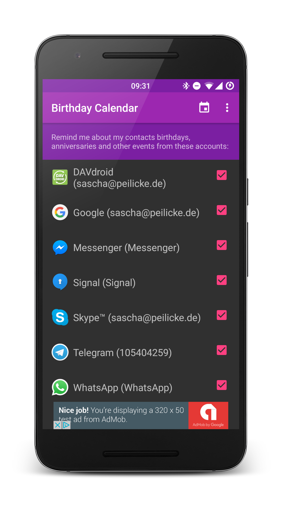

# Birthday Calendar

Get a birthday calendar for all your social networks right inside Google
Calendar. Supports *Facebook*, *LinkedIn*, *Xing*, *Skype*, *DavDroid* and all
other apps which sync contacts with your Android device. Enable reminder
alarms and decide which contacts you want to see. You'll get notifications
for all of them.

## Features
- Birthdays and anniversaries for all your contacts
- Customizable reminders (same day, one day in advance, ...) and the calendar
   color
- Hide the app icon after setting it up so that it does not get in your way
- Tablet support

## Source code
The source demonstrates how to use Android's account and sync frameworks as well
how to create services, intent services and the communication between the
components. It also showcases the usage of the contacts and calendar providers.

## Screenshots

## Download

## Acknowledgement
Sam Steele and Dominik Schürmann for providing the initial implementation of the calendar sync service.

## License

    Copyright (C) 2016 Sascha Peilicke  
    
    This program is free software: you can redistribute it and/or modify
    it under the terms of the GNU General Public License as published by
    the Free Software Foundation, either version 3 of the License, or
    (at your option) any later version.
    
    This program is distributed in the hope that it will be useful,
    but WITHOUT ANY WARRANTY; without even the implied warranty of
    MERCHANTABILITY or FITNESS FOR A PARTICULAR PURPOSE.  See the
    GNU General Public License for more details.
    
    You should have received a copy of the GNU General Public License
    along with this program.  If not, see <http://www.gnu.org/licenses/>.

